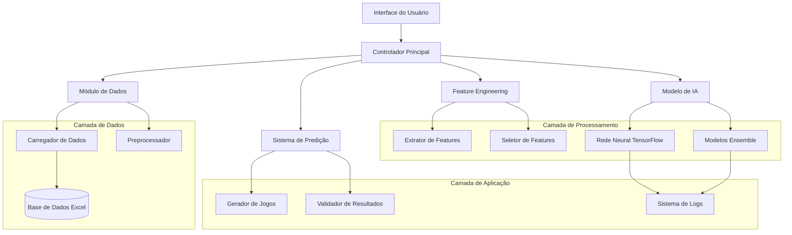
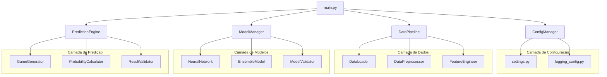
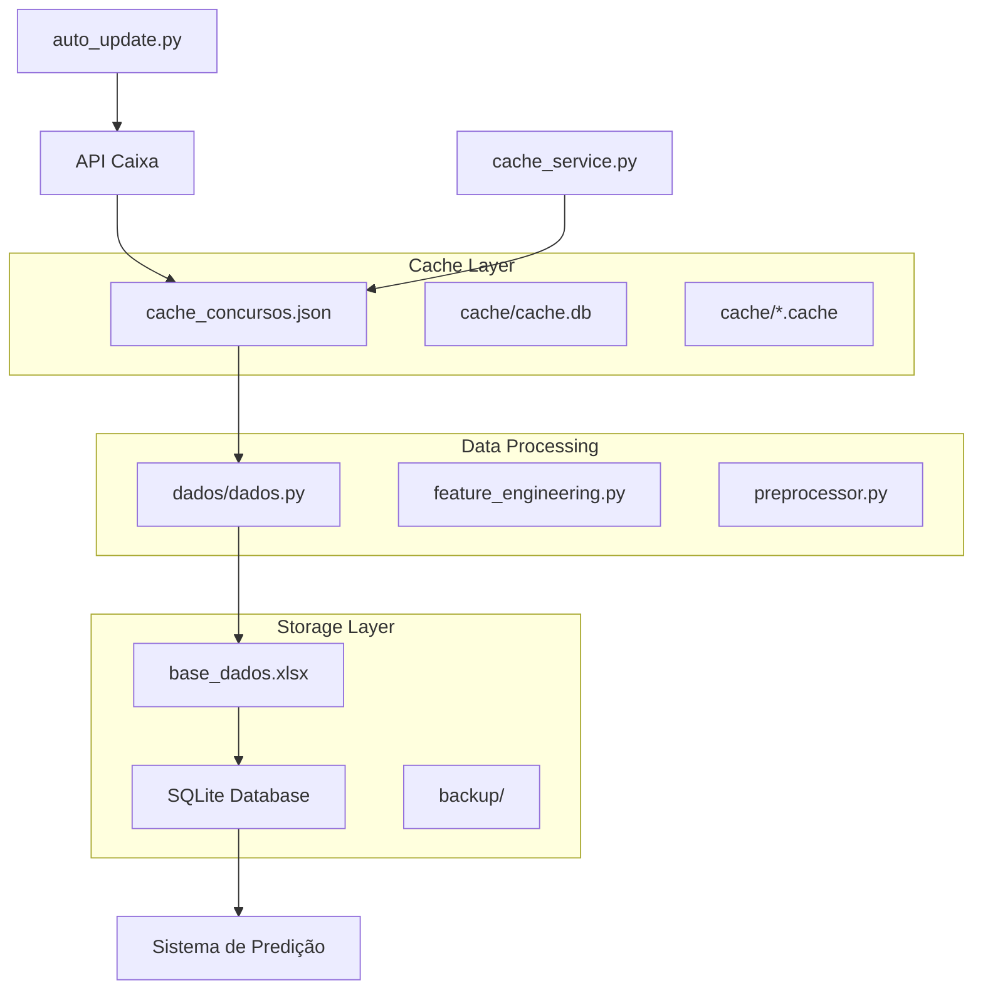
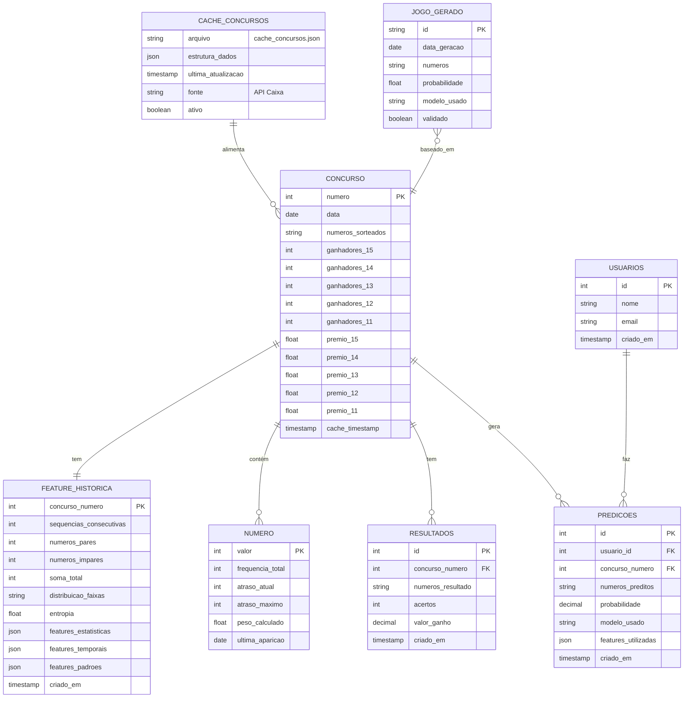

# Arquitetura Técnica Modernizada - Projeto Lotofácil
## Especificações Técnicas para Python 3.13.7

## 1. Arquitetura do Sistema



## 2. Descrição das Tecnologias

### 2.1 Stack Principal
- **Frontend:** Python 3.13.7 (CLI/Script)
- **Backend:** TensorFlow 2.15.0 + Scikit-learn 1.4.0
- **Dados:** Pandas 2.1.0 + NumPy 1.24.0
- **Processamento:** Numba 0.58.0 (JIT compilation)

### 2.2 Dependências Específicas
```python
# requirements.txt modernizado
tensorflow>=2.15.0,<3.0.0
numpy>=1.24.0,<2.0.0
pandas>=2.1.0,<3.0.0
scikit-learn>=1.4.0,<2.0.0
requests>=2.31.0,<3.0.0
xlrd>=2.0.1
openpyxl>=3.1.0
matplotlib>=3.8.0
seaborn>=0.13.0
plotly>=5.17.0
numba>=0.58.0
joblib>=1.3.0
pydantic>=2.5.0
pytest>=7.4.0
black>=23.0.0
flake8>=6.0.0
```

## 3. Definições de Rotas/Módulos

| Módulo | Propósito | Arquivo Principal |
|--------|-----------|-------------------|
| `/src/data/` | Carregamento e preprocessamento de dados | `loader.py`, `preprocessor.py` |
| `/src/features/` | Engenharia e seleção de features | `engineering.py`, `selection.py` |
| `/src/models/` | Modelos de machine learning | `neural_network.py`, `ensemble.py` |
| `/src/evaluation/` | Métricas e validação | `metrics.py`, `validation.py` |
| `/src/utils/` | Utilitários e constantes | `helpers.py`, `constants.py` |
| `/config/` | Configurações do sistema | `settings.py`, `logging_config.py` |
| `/tests/` | Testes automatizados | `test_*.py` |

## 4. APIs e Interfaces Internas

### 4.1 Interface do Carregador de Dados

```python
from typing import Dict, List, Tuple, Optional
import pandas as pd
from pydantic import BaseModel

class DadosLotofacil(BaseModel):
    concurso: int
    data: str
    numeros_sorteados: List[int]
    ganhadores: int
    
class CarregadorDados:
    def carregar_planilha(self, caminho: str) -> pd.DataFrame:
        """Carrega dados da planilha Excel"""
        pass
    
    def validar_dados(self, dados: pd.DataFrame) -> bool:
        """Valida integridade dos dados"""
        pass
    
    def obter_historico(
        self, 
        data_inicio: Optional[str] = None,
        data_fim: Optional[str] = None
    ) -> List[DadosLotofacil]:
        """Obtém histórico filtrado por período"""
        pass
```

### 4.2 Interface do Feature Engineering

```python
from abc import ABC, abstractmethod
import numpy as np
from typing import Dict, Any

class BaseFeatureExtractor(ABC):
    @abstractmethod
    def extrair(self, dados: pd.DataFrame) -> Dict[str, Any]:
        """Extrai features dos dados"""
        pass

class FeaturesTemporal(BaseFeatureExtractor):
    def extrair(self, dados: pd.DataFrame) -> Dict[str, Any]:
        return {
            'mes': dados['data'].dt.month,
            'trimestre': dados['data'].dt.quarter,
            'dia_semana': dados['data'].dt.dayofweek,
            'dias_desde_ultimo': self._calcular_dias_desde_ultimo(dados)
        }

class FeaturesEstatisticas(BaseFeatureExtractor):
    def extrair(self, dados: pd.DataFrame) -> Dict[str, Any]:
        return {
            'frequencia_numeros': self._calcular_frequencias(dados),
            'atraso_numeros': self._calcular_atrasos(dados),
            'tendencia_numeros': self._calcular_tendencias(dados)
        }

class FeaturesCombinatoria(BaseFeatureExtractor):
    def extrair(self, dados: pd.DataFrame) -> Dict[str, Any]:
        return {
            'sequencias_consecutivas': self._contar_sequencias(dados),
            'paridade_distribuicao': self._analisar_paridade(dados),
            'soma_total': self._calcular_somas(dados),
            'distribuicao_faixas': self._analisar_distribuicao(dados)
        }
```

### 4.3 Interface do Modelo Neural

```python
import tensorflow as tf
from tensorflow.keras.models import Sequential
from tensorflow.keras.layers import Dense, Dropout, BatchNormalization
from tensorflow.keras.callbacks import Callback
from typing import Tuple, List, Optional

class ModeloLotofacil:
    def __init__(self, config: Dict[str, Any]):
        self.config = config
        self.modelo: Optional[Sequential] = None
        self.historico_treino: Optional[tf.keras.callbacks.History] = None
    
    def construir_modelo(self) -> Sequential:
        """Constrói a arquitetura da rede neural"""
        modelo = Sequential([
            Dense(
                self.config['camadas'][0], 
                activation='relu', 
                input_shape=(self.config['input_dim'],)
            ),
            BatchNormalization(),
            Dropout(self.config['dropout_rate']),
            
            Dense(self.config['camadas'][1], activation='relu'),
            BatchNormalization(),
            Dropout(self.config['dropout_rate']),
            
            Dense(self.config['camadas'][2], activation='relu'),
            BatchNormalization(),
            Dropout(self.config['dropout_rate'] / 2),
            
            Dense(15, activation='sigmoid')  # 15 números da Lotofácil
        ])
        
        modelo.compile(
            optimizer=tf.keras.optimizers.Adam(
                learning_rate=self.config['learning_rate']
            ),
            loss='binary_crossentropy',
            metrics=['accuracy', 'precision', 'recall', 'f1_score']
        )
        
        return modelo
    
    def treinar(
        self, 
        X_train: np.ndarray, 
        y_train: np.ndarray,
        X_val: np.ndarray, 
        y_val: np.ndarray
    ) -> tf.keras.callbacks.History:
        """Treina o modelo com dados de treino e validação"""
        if self.modelo is None:
            self.modelo = self.construir_modelo()
        
        callbacks = self._obter_callbacks()
        
        self.historico_treino = self.modelo.fit(
            X_train, y_train,
            validation_data=(X_val, y_val),
            epochs=self.config['epochs'],
            batch_size=self.config['batch_size'],
            callbacks=callbacks,
            verbose=1
        )
        
        return self.historico_treino
    
    def predizer(self, X: np.ndarray) -> np.ndarray:
        """Faz predições com o modelo treinado"""
        if self.modelo is None:
            raise ValueError("Modelo não foi treinado")
        
        return self.modelo.predict(X)
    
    def avaliar(self, X_test: np.ndarray, y_test: np.ndarray) -> Dict[str, float]:
        """Avalia o modelo com dados de teste"""
        if self.modelo is None:
            raise ValueError("Modelo não foi treinado")
        
        resultados = self.modelo.evaluate(X_test, y_test, verbose=0)
        metricas = self.modelo.metrics_names
        
        return dict(zip(metricas, resultados))
```

## 5. Arquitetura do Servidor (Estrutura Interna)



## 6. Sistema de Cache e Integração de Dados

### 6.1 Arquitetura do Sistema de Cache



### 6.2 Definição do Modelo de Dados



### 6.2 Estruturas de Dados (Classes Python)

```python
from dataclasses import dataclass
from typing import List, Optional, Dict
from datetime import datetime
import numpy as np

@dataclass
class Concurso:
    """Representa um concurso da Lotofácil"""
    numero: int
    data: datetime
    numeros_sorteados: List[int]
    ganhadores: Dict[str, int]  # {'15': 1, '14': 150, ...}
    premios: Dict[str, float]   # {'15': 1500000.0, '14': 1500.0, ...}
    
    def __post_init__(self):
        if len(self.numeros_sorteados) != 15:
            raise ValueError("Concurso deve ter exatamente 15 números")
        if not all(1 <= n <= 25 for n in self.numeros_sorteados):
            raise ValueError("Números devem estar entre 1 e 25")

@dataclass
class NumeroEstatistica:
    """Estatísticas de um número específico"""
    valor: int
    frequencia_total: int
    atraso_atual: int
    atraso_maximo: int
    peso_calculado: float
    ultima_aparicao: Optional[datetime] = None
    tendencia: Optional[str] = None  # 'crescente', 'decrescente', 'estável'

@dataclass
class JogoGerado:
    """Representa um jogo gerado pelo sistema"""
    id: str
    data_geracao: datetime
    numeros: List[int]
    probabilidade: float
    modelo_usado: str
    features_utilizadas: List[str]
    validado: bool = False
    
    def __post_init__(self):
        if len(self.numeros) != 15:
            raise ValueError("Jogo deve ter exatamente 15 números")
        if len(set(self.numeros)) != 15:
            raise ValueError("Números não podem se repetir")
        self.numeros = sorted(self.numeros)

@dataclass
class FeatureVector:
    """Vetor de features para um concurso"""
    concurso_numero: int
    features_temporais: Dict[str, float]
    features_estatisticas: Dict[str, float]
    features_combinatorias: Dict[str, float]
    
    def to_array(self) -> np.ndarray:
        """Converte para array numpy para uso no modelo"""
        all_features = []
        all_features.extend(self.features_temporais.values())
        all_features.extend(self.features_estatisticas.values())
        all_features.extend(self.features_combinatorias.values())
        return np.array(all_features, dtype=np.float32)
```

### 6.3 Configuração do Sistema

```python
# config/settings.py
from typing import Dict, Any, List
from pathlib import Path

class Config:
    """Configurações centralizadas do sistema"""
    
    # Caminhos
    BASE_DIR = Path(__file__).parent.parent
    DATA_DIR = BASE_DIR / "data"
    MODELS_DIR = BASE_DIR / "models"
    LOGS_DIR = BASE_DIR / "logs"
    
    # Dados
    PLANILHA_DADOS = DATA_DIR / "lotofacil_historico.xlsx"
    BACKUP_DIR = DATA_DIR / "backups"
    
    # Modelo Neural
    MODELO_CONFIG = {
        'input_dim': 50,  # Número de features
        'camadas': [128, 64, 32],
        'dropout_rate': 0.3,
        'learning_rate': 0.001,
        'epochs': 200,
        'batch_size': 32,
        'validation_split': 0.2
    }
    
    # Features
    FEATURES_ATIVAS = [
        'temporais',
        'estatisticas', 
        'combinatorias',
        'sequenciais'
    ]
    
    # Geração de Jogos
    JOGO_CONFIG = {
        'probabilidade_minima': 0.1,
        'max_tentativas': 10000,
        'evitar_repetidos': True,
        'usar_pesos': True
    }
    
    # Logging
    LOG_LEVEL = "INFO"
    LOG_FORMAT = "%(asctime)s - %(name)s - %(levelname)s - %(message)s"
    
    # Performance
    USE_GPU = True
    PARALLEL_JOBS = -1  # Usar todos os cores disponíveis
    JIT_COMPILE = True  # Usar Numba JIT
```

## 7. Otimizações Específicas do Python 3.13.7

### 7.1 Free-threaded Mode

```python
# Aproveitamento do modo free-threaded
import threading
from concurrent.futures import ThreadPoolExecutor
import numpy as np

class ProcessadorParalelo:
    def __init__(self, max_workers: int = None):
        self.max_workers = max_workers or threading.cpu_count()
    
    def processar_concursos_paralelo(
        self, 
        concursos: List[Concurso]
    ) -> List[FeatureVector]:
        """Processa múltiplos concursos em paralelo"""
        with ThreadPoolExecutor(max_workers=self.max_workers) as executor:
            futures = [
                executor.submit(self._extrair_features, concurso)
                for concurso in concursos
            ]
            return [future.result() for future in futures]
```

### 7.2 JIT Compilation com Numba

```python
from numba import jit, njit, prange
import numpy as np

@njit(parallel=True)
def calcular_pesos_otimizado(
    frequencias: np.ndarray, 
    atrasos: np.ndarray,
    ciclo_completo: int = 25
) -> np.ndarray:
    """Versão JIT-compiled para cálculo de pesos"""
    n = len(frequencias)
    pesos = np.zeros(n, dtype=np.float64)
    
    for i in prange(n):
        faltante = ciclo_completo - frequencias[i]
        peso_base = frequencias[i] + faltante * 0.1
        peso_atraso = atrasos[i] * 0.05
        pesos[i] = peso_base + peso_atraso
    
    # Normalização
    soma_total = np.sum(pesos)
    for i in prange(n):
        pesos[i] = pesos[i] / soma_total
    
    return pesos

@njit
def calcular_entropia(numeros: np.ndarray) -> float:
    """Calcula entropia de Shannon para um conjunto de números"""
    _, counts = np.unique(numeros, return_counts=True)
    probabilities = counts / len(numeros)
    entropy = 0.0
    
    for p in probabilities:
        if p > 0:
            entropy -= p * np.log2(p)
    
    return entropy
```

### 7.3 Melhorias de Memory Management

```python
import gc
from typing import Generator
import numpy as np

class GerenciadorMemoria:
    """Gerencia uso eficiente de memória"""
    
    @staticmethod
    def processar_em_lotes(
        dados: np.ndarray, 
        tamanho_lote: int = 1000
    ) -> Generator[np.ndarray, None, None]:
        """Processa dados em lotes para economizar memória"""
        for i in range(0, len(dados), tamanho_lote):
            lote = dados[i:i + tamanho_lote]
            yield lote
            # Força garbage collection após cada lote
            gc.collect()
    
    @staticmethod
    def limpar_cache_tensorflow():
        """Limpa cache do TensorFlow"""
        import tensorflow as tf
        tf.keras.backend.clear_session()
        gc.collect()
```

## 8. Monitoramento e Logging

```python
# config/logging_config.py
import logging
import logging.handlers
from pathlib import Path
from typing import Dict, Any

def configurar_logging(config: Dict[str, Any]) -> None:
    """Configura sistema de logging avançado"""
    
    # Criar diretório de logs se não existir
    log_dir = Path(config['log_dir'])
    log_dir.mkdir(exist_ok=True)
    
    # Configuração do formatter
    formatter = logging.Formatter(
        fmt=config['format'],
        datefmt='%Y-%m-%d %H:%M:%S'
    )
    
    # Logger principal
    logger = logging.getLogger('lotofacil')
    logger.setLevel(getattr(logging, config['level']))
    
    # Handler para arquivo (com rotação)
    file_handler = logging.handlers.RotatingFileHandler(
        filename=log_dir / 'lotofacil.log',
        maxBytes=10*1024*1024,  # 10MB
        backupCount=5
    )
    file_handler.setFormatter(formatter)
    logger.addHandler(file_handler)
    
    # Handler para console
    console_handler = logging.StreamHandler()
    console_handler.setFormatter(formatter)
    logger.addHandler(console_handler)
    
    # Logger específico para métricas
    metrics_logger = logging.getLogger('lotofacil.metrics')
    metrics_handler = logging.FileHandler(log_dir / 'metrics.log')
    metrics_handler.setFormatter(formatter)
    metrics_logger.addHandler(metrics_handler)
```

## 9. Testes e Qualidade

### 9.1 Estrutura de Testes

```python
# tests/conftest.py
import pytest
import numpy as np
import pandas as pd
from datetime import datetime, timedelta
from typing import List

@pytest.fixture
def dados_mock() -> pd.DataFrame:
    """Dados mock para testes"""
    dados = []
    for i in range(100):
        concurso = {
            'Concurso': 1000 + i,
            'Data': datetime.now() - timedelta(days=i),
            'Bola1': np.random.randint(1, 26),
            'Bola2': np.random.randint(1, 26),
            # ... mais bolas
            'Ganhadores_15_numeros': np.random.randint(0, 5)
        }
        dados.append(concurso)
    
    return pd.DataFrame(dados)

@pytest.fixture
def modelo_config() -> dict:
    """Configuração de teste para modelo"""
    return {
        'input_dim': 25,
        'camadas': [32, 16, 8],
        'dropout_rate': 0.2,
        'learning_rate': 0.01,
        'epochs': 5,
        'batch_size': 16
    }
```

### 9.2 Testes de Performance

```python
# tests/test_performance.py
import pytest
import time
import psutil
import numpy as np
from src.models.neural_network import ModeloLotofacil

class TestPerformance:
    def test_tempo_treinamento(self, modelo_config, dados_mock):
        """Testa se o treinamento não excede tempo limite"""
        modelo = ModeloLotofacil(modelo_config)
        
        # Dados sintéticos para teste
        X = np.random.random((1000, modelo_config['input_dim']))
        y = np.random.randint(0, 2, (1000, 15))
        
        start_time = time.time()
        modelo.treinar(X[:800], y[:800], X[800:], y[800:])
        tempo_treinamento = time.time() - start_time
        
        # Deve treinar em menos de 30 segundos para dados pequenos
        assert tempo_treinamento < 30.0
    
    def test_uso_memoria(self, modelo_config):
        """Testa se o uso de memória está dentro do esperado"""
        processo = psutil.Process()
        memoria_inicial = processo.memory_info().rss
        
        modelo = ModeloLotofacil(modelo_config)
        modelo.construir_modelo()
        
        memoria_final = processo.memory_info().rss
        uso_memoria = memoria_final - memoria_inicial
        
        # Não deve usar mais que 500MB para modelo pequeno
        assert uso_memoria < 500 * 1024 * 1024
```

## 10. Deployment e Produção

### 10.1 Script de Deployment

```python
# deploy.py
import subprocess
import sys
from pathlib import Path
import logging

def verificar_python_version():
    """Verifica se está usando Python 3.13+"""
    if sys.version_info < (3, 13):
        raise RuntimeError(
            f"Python 3.13+ requerido. Versão atual: {sys.version}"
        )

def instalar_dependencias():
    """Instala dependências do requirements.txt"""
    subprocess.check_call([
        sys.executable, "-m", "pip", "install", "-r", "requirements.txt"
    ])

def executar_testes():
    """Executa suite de testes"""
    result = subprocess.run([
        sys.executable, "-m", "pytest", "tests/", "-v"
    ])
    if result.returncode != 0:
        raise RuntimeError("Testes falharam")

def main():
    """Script principal de deployment"""
    logging.basicConfig(level=logging.INFO)
    logger = logging.getLogger(__name__)
    
    try:
        logger.info("Verificando versão do Python...")
        verificar_python_version()
        
        logger.info("Instalando dependências...")
        instalar_dependencias()
        
        logger.info("Executando testes...")
        executar_testes()
        
        logger.info("Deployment concluído com sucesso!")
        
    except Exception as e:
        logger.error(f"Erro no deployment: {e}")
        sys.exit(1)

if __name__ == "__main__":
    main()
```

Esta arquitetura técnica modernizada aproveita ao máximo as capacidades do Python 3.13.7 e do TensorFlow 2.x, proporcionando uma base sólida, escalável e maintível para o projeto Lotofácil atualizado.