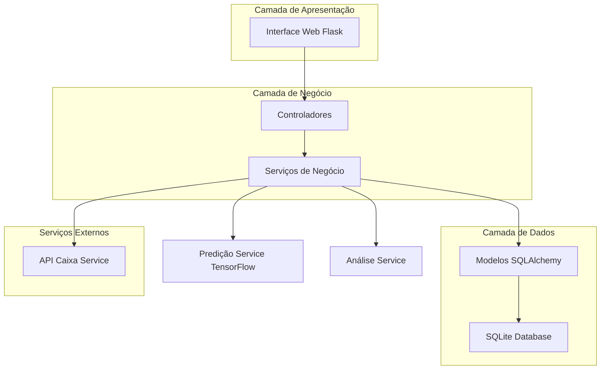
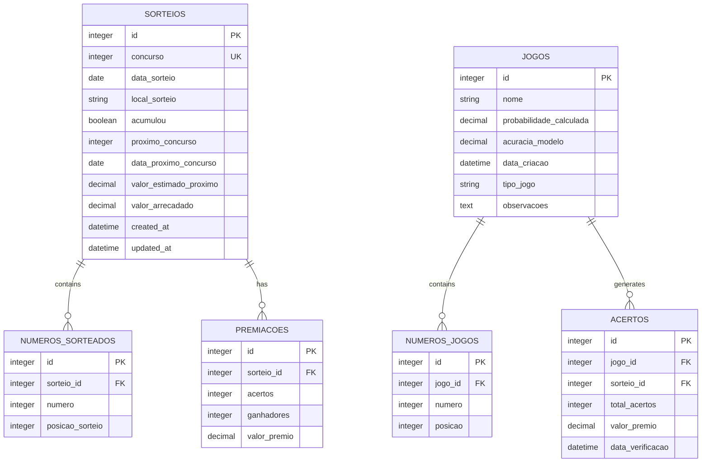

# Especificações Técnicas - Modernização Sistema Lotofácil

## 1. Visão Geral do Projeto

Modernização completa do sistema de predição Lotofácil para uso pessoal, migrando de Excel para SQLite com atualização automática via API da Caixa, melhorias no algoritmo de predição e funcionalidades avançadas de análise.

**Objetivos Principais:**
- Migrar dados de Excel para SQLite
- Implementar atualização automática via API da Caixa
- Melhorar algoritmo de predição com TensorFlow 2.x
- Adicionar funcionalidades de fechamentos e desdobramentos
- Interface para análise de acertos e informações de sorteios

## 2. Arquitetura do Sistema



## 3. Stack Tecnológica

- **Backend:** Flask 2.3+ + SQLAlchemy 2.0+
- **Database:** SQLite 3.x
- **ML/AI:** TensorFlow 2.x (migração do Keras)
- **Validação:** Pydantic 2.x
- **HTTP Client:** Requests 2.x
- **Processamento:** Pandas 2.x, NumPy 1.x
- **Interface:** Flask Templates + Bootstrap 5
- **Formatação:** Black (line-length=88)

## 4. Estrutura do Banco de Dados

### 4.1 Modelo de Dados



### 4.2 Scripts DDL

```sql
-- Tabela de sorteios
CREATE TABLE sorteios (
    id INTEGER PRIMARY KEY AUTOINCREMENT,
    concurso INTEGER UNIQUE NOT NULL,
    data_sorteio DATE NOT NULL,
    local_sorteio TEXT,
    acumulou BOOLEAN DEFAULT FALSE,
    proximo_concurso INTEGER,
    data_proximo_concurso DATE,
    valor_estimado_proximo DECIMAL(15,2),
    valor_arrecadado DECIMAL(15,2),
    created_at DATETIME DEFAULT CURRENT_TIMESTAMP,
    updated_at DATETIME DEFAULT CURRENT_TIMESTAMP
);

-- Tabela de números sorteados
CREATE TABLE numeros_sorteados (
    id INTEGER PRIMARY KEY AUTOINCREMENT,
    sorteio_id INTEGER NOT NULL,
    numero INTEGER NOT NULL CHECK (numero BETWEEN 1 AND 25),
    posicao_sorteio INTEGER NOT NULL CHECK (posicao_sorteio BETWEEN 1 AND 15),
    FOREIGN KEY (sorteio_id) REFERENCES sorteios(id) ON DELETE CASCADE
);

-- Tabela de premiações
CREATE TABLE premiacoes (
    id INTEGER PRIMARY KEY AUTOINCREMENT,
    sorteio_id INTEGER NOT NULL,
    acertos INTEGER NOT NULL CHECK (acertos BETWEEN 11 AND 15),
    ganhadores INTEGER NOT NULL DEFAULT 0,
    valor_premio DECIMAL(15,2) NOT NULL DEFAULT 0,
    FOREIGN KEY (sorteio_id) REFERENCES sorteios(id) ON DELETE CASCADE
);

-- Tabela de jogos gerados
CREATE TABLE jogos (
    id INTEGER PRIMARY KEY AUTOINCREMENT,
    nome TEXT NOT NULL,
    probabilidade_calculada DECIMAL(5,2),
    acuracia_modelo DECIMAL(5,2),
    data_criacao DATETIME DEFAULT CURRENT_TIMESTAMP,
    tipo_jogo TEXT DEFAULT 'simples' CHECK (tipo_jogo IN ('simples', 'fechamento', 'desdobramento')),
    observacoes TEXT
);

-- Tabela de números dos jogos
CREATE TABLE numeros_jogos (
    id INTEGER PRIMARY KEY AUTOINCREMENT,
    jogo_id INTEGER NOT NULL,
    numero INTEGER NOT NULL CHECK (numero BETWEEN 1 AND 25),
    posicao INTEGER NOT NULL CHECK (posicao BETWEEN 1 AND 15),
    FOREIGN KEY (jogo_id) REFERENCES jogos(id) ON DELETE CASCADE
);

-- Tabela de acertos
CREATE TABLE acertos (
    id INTEGER PRIMARY KEY AUTOINCREMENT,
    jogo_id INTEGER NOT NULL,
    sorteio_id INTEGER NOT NULL,
    total_acertos INTEGER NOT NULL CHECK (total_acertos BETWEEN 0 AND 15),
    valor_premio DECIMAL(15,2) DEFAULT 0,
    data_verificacao DATETIME DEFAULT CURRENT_TIMESTAMP,
    FOREIGN KEY (jogo_id) REFERENCES jogos(id) ON DELETE CASCADE,
    FOREIGN KEY (sorteio_id) REFERENCES sorteios(id) ON DELETE CASCADE
);

-- Índices para performance
CREATE INDEX idx_sorteios_concurso ON sorteios(concurso);
CREATE INDEX idx_sorteios_data ON sorteios(data_sorteio DESC);
CREATE INDEX idx_numeros_sorteados_sorteio ON numeros_sorteados(sorteio_id);
CREATE INDEX idx_premiacoes_sorteio ON premiacoes(sorteio_id);
CREATE INDEX idx_jogos_data ON jogos(data_criacao DESC);
CREATE INDEX idx_numeros_jogos_jogo ON numeros_jogos(jogo_id);
CREATE INDEX idx_acertos_jogo_sorteio ON acertos(jogo_id, sorteio_id);
```

## 5. Definições de API

### 5.1 Integração API Caixa

**Endpoint Base:** `https://loteriascaixa-api.herokuapp.com/api/lotofacil`

```python
from pydantic import BaseModel, Field
from typing import List, Optional
from datetime import date, datetime

class Premiacao(BaseModel):
    descricao: str
    faixa: int
    ganhadores: int
    valor_premio: float = Field(alias="valorPremio")

class LocalGanhador(BaseModel):
    ganhadores: int
    municipio: str
    uf: str
    posicao: int

class SorteioApiResponse(BaseModel):
    loteria: str
    concurso: int
    data: str
    local: str
    dezenas: List[str]
    dezenas_ordem_sorteio: List[str] = Field(alias="dezenasOrdemSorteio")
    premiacoes: List[Premiacao]
    acumulou: bool
    proximo_concurso: int = Field(alias="proximoConcurso")
    data_proximo_concurso: str = Field(alias="dataProximoConcurso")
    valor_estimado_proximo_concurso: float = Field(alias="valorEstimadoProximoConcurso")
    valor_arrecadado: float = Field(alias="valorArrecadado")
    local_ganhadores: List[LocalGanhador] = Field(alias="localGanhadores")
```

### 5.2 APIs Internas

#### Atualização de Dados
```python
POST /api/sorteios/atualizar
```
**Descrição:** Busca novos sorteios da API da Caixa e atualiza o banco

**Response:**
```json
{
    "status": "success",
    "novos_sorteios": 3,
    "ultimo_concurso": 2850,
    "message": "Base atualizada com sucesso"
}
```

#### Geração de Jogos
```python
POST /api/jogos/gerar
```
**Request:**
```json
{
    "tipo": "simples",
    "probabilidade_minima": 85.0,
    "quantidade": 1,
    "nome": "Jogo Teste"
}
```

**Response:**
```json
{
    "jogo_id": 123,
    "numeros": [1, 3, 5, 7, 9, 11, 13, 15, 17, 19, 21, 23, 24, 25, 2],
    "probabilidade": 87.5,
    "acuracia_modelo": 92.3
}
```

#### Verificação de Acertos
```python
POST /api/jogos/{jogo_id}/verificar-acertos
```
**Response:**
```json
{
    "jogo_id": 123,
    "acertos_por_sorteio": [
        {
            "concurso": 2849,
            "acertos": 12,
            "valor_premio": 10.00,
            "numeros_acertados": [1, 3, 5, 7, 9, 11, 13, 15, 17, 19, 21, 23]
        }
    ],
    "total_premios": 10.00
}
```

## 6. Serviços de Negócio

### 6.1 Serviço de Atualização (CaixaApiService)

```python
class CaixaApiService:
    """Serviço para integração com API da Caixa"""
    
    def buscar_ultimo_sorteio(self) -> SorteioApiResponse:
        """Busca o último sorteio disponível"""
        
    def buscar_sorteio_por_concurso(self, concurso: int) -> SorteioApiResponse:
        """Busca sorteio específico por número do concurso"""
        
    def atualizar_base_dados(self) -> dict:
        """Atualiza base local com novos sorteios"""
```

### 6.2 Serviço de Predição (PredicaoService)

```python
class PredicaoService:
    """Serviço de predição usando TensorFlow 2.x"""
    
    def treinar_modelo(self) -> tuple[float, str]:
        """Treina modelo com dados atualizados"""
        
    def gerar_jogo_simples(self, prob_minima: float) -> dict:
        """Gera jogo simples com probabilidade mínima"""
        
    def gerar_fechamento(self, numeros_base: List[int], tipo: str) -> List[dict]:
        """Gera fechamentos baseado em números fixos"""
        
    def gerar_desdobramento(self, numeros_pool: List[int], qtd_jogos: int) -> List[dict]:
        """Gera desdobramentos otimizados"""
```

### 6.3 Serviço de Análise (AnaliseService)

```python
class AnaliseService:
    """Serviço para análises estatísticas e verificações"""
    
    def verificar_acertos_jogo(self, jogo_id: int) -> dict:
        """Verifica acertos de um jogo em todos os sorteios"""
        
    def calcular_frequencia_numeros(self, periodo_dias: int = 365) -> dict:
        """Calcula frequência dos números em período específico"""
        
    def obter_estatisticas_gerais(self) -> dict:
        """Retorna estatísticas gerais do sistema"""
```

## 7. Funcionalidades Específicas

### 7.1 Fechamentos

**Tipos Suportados:**
- Fechamento Garantia 11 pontos
- Fechamento Garantia 12 pontos  
- Fechamento Garantia 13 pontos
- Fechamento Garantia 14 pontos

**Implementação:**
```python
def gerar_fechamento_garantia_11(numeros_fixos: List[int], numeros_variaveis: List[int]) -> List[List[int]]:
    """Gera fechamento garantindo pelo menos 11 acertos"""
    # Algoritmo de combinação otimizada
    pass
```

### 7.2 Desdobramentos

**Estratégias:**
- Desdobramento por frequência
- Desdobramento por padrões históricos
- Desdobramento balanceado (pares/ímpares, baixos/altos)

### 7.3 Interface de Análise

**Funcionalidades da Interface:**
1. **Dashboard Principal:**
   - Último sorteio realizado
   - Próximo sorteio e valor estimado
   - Estatísticas gerais

2. **Gerador de Jogos:**
   - Seleção de tipo (simples/fechamento/desdobramento)
   - Configuração de probabilidade mínima
   - Visualização de números gerados

3. **Verificador de Acertos:**
   - Upload/seleção de jogos
   - Destaque visual dos acertos
   - Cálculo de premiação

4. **Análises Estatísticas:**
   - Frequência de números
   - Padrões temporais
   - Gráficos de tendências

## 8. Plano de Migração

### 8.1 Fase 1: Preparação da Infraestrutura
1. Configurar ambiente Flask + SQLAlchemy
2. Criar estrutura do banco SQLite
3. Implementar modelos de dados
4. Configurar sistema de migrações

### 8.2 Fase 2: Migração de Dados
1. Extrair dados do Excel atual
2. Transformar formato para SQLite
3. Validar integridade dos dados migrados
4. Implementar backup automático

### 8.3 Fase 3: Integração API Caixa
1. Implementar cliente HTTP para API
2. Criar serviço de atualização automática
3. Configurar agendamento de tarefas
4. Implementar tratamento de erros

### 8.4 Fase 4: Modernização do Modelo
1. Migrar de Keras para TensorFlow 2.x
2. Otimizar arquitetura da rede neural
3. Implementar validação cruzada temporal
4. Adicionar métricas avançadas

### 8.5 Fase 5: Funcionalidades Avançadas
1. Implementar algoritmos de fechamento
2. Desenvolver sistema de desdobramentos
3. Criar interface web responsiva
4. Implementar verificador de acertos

## 9. Configuração e Deploy

### 9.1 Variáveis de Ambiente
```bash
# .env
FLASK_ENV=development
DATABASE_URL=sqlite:///lotofacil.db
CRYPT_KEY=sua_chave_secreta_aqui
API_CAIXA_BASE_URL=https://loteriascaixa-api.herokuapp.com/api
LOG_LEVEL=INFO
BACKUP_INTERVAL_HOURS=24
```

### 9.2 Estrutura de Arquivos
```
lotofacil/
├── app/
│   ├── __init__.py
│   ├── models/
│   ├── services/
│   ├── controllers/
│   ├── templates/
│   └── static/
├── migrations/
├── tests/
├── config.py
├── requirements.txt
├── run.py
└── .env
```

### 9.3 Comandos de Inicialização
```bash
# Instalar dependências
pip install -r requirements.txt

# Inicializar banco
flask db init
flask db migrate -m "Initial migration"
flask db upgrade

# Migrar dados do Excel
python scripts/migrate_excel_data.py

# Executar aplicação
python run.py
```

## 10. Considerações de Segurança

1. **Dados Locais:** Sistema standalone sem exposição externa
2. **Backup:** Backup automático diário do SQLite
3. **Logs:** Logs estruturados sem dados sensíveis
4. **Validação:** Pydantic para validação de entrada
5. **Rate Limiting:** Controle de chamadas à API externa

## 11. Monitoramento e Manutenção

1. **Health Check:** Endpoint para verificar status do sistema
2. **Logs Estruturados:** Logging com níveis apropriados
3. **Métricas:** Acompanhamento de acurácia do modelo
4. **Alertas:** Notificação de falhas na atualização
5. **Backup:** Estratégia de backup e recuperação

Este documento serve como especificação completa para a modernização do sistema Lotofácil, seguindo as regras estabelecidas do projeto com foco em execução linear, soluções diretas e documentação inline.