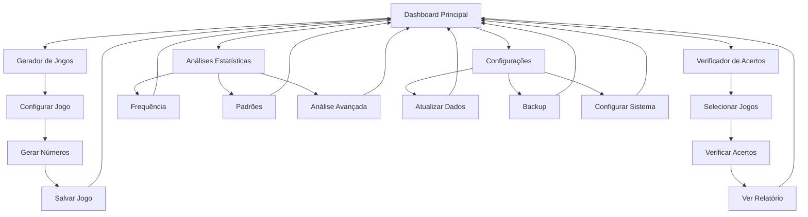

# Requisitos de Produto - Sistema Lotofácil Modernizado

## 1. Visão Geral do Produto

Sistema pessoal de predição e análise para Lotofácil com inteligência artificial, permitindo geração de jogos otimizados, análise de acertos e acompanhamento automático de resultados. O sistema utiliza algoritmos de machine learning para aumentar as chances de acerto e oferece funcionalidades avançadas como fechamentos e desdobramentos.

- **Problema a resolver:** Melhorar as chances de acerto na Lotofácil através de análise estatística e predição inteligente
- **Usuário:** Pessoa física para uso pessoal e não comercial
- **Valor:** Sistema standalone com dados sempre atualizados e análises precisas

## 2. Funcionalidades Principais

### 2.1 Papéis de Usuário

Sistema de uso pessoal sem distinção de papéis - acesso completo a todas as funcionalidades.

### 2.2 Módulos Funcionais

O sistema modernizado consiste nas seguintes páginas principais:

1. **Dashboard Principal**: visão geral, último sorteio, próximo prêmio, estatísticas gerais
2. **Gerador de Jogos**: criação de jogos simples, fechamentos e desdobramentos
3. **Verificador de Acertos**: análise de jogos anteriores com destaque visual dos acertos
4. **Análises Estatísticas**: frequência de números, padrões e tendências
5. **Configurações**: atualização de dados, backup e configurações do sistema

### 2.3 Detalhes das Páginas

| Página | Módulo | Descrição da Funcionalidade |
|--------|--------|--------------------------|
| Dashboard Principal | Painel de Informações | Exibir último sorteio realizado com números e data, mostrar valor estimado do próximo prêmio, apresentar estatísticas gerais do sistema |
| Dashboard Principal | Indicadores de Status | Mostrar status da última atualização de dados, exibir acurácia atual do modelo de predição, indicar quantidade de jogos salvos |
| Gerador de Jogos | Configuração de Jogo | Selecionar tipo de jogo (simples, fechamento, desdobramento), definir probabilidade mínima desejada, configurar parâmetros específicos |
| Gerador de Jogos | Geração Inteligente | Gerar números usando algoritmo de IA, aplicar pesos estatísticos, validar combinações contra histórico |
| Gerador de Jogos | Visualização de Resultados | Exibir números gerados ordenados, mostrar probabilidade calculada, salvar jogo com nome personalizado |
| Verificador de Acertos | Seleção de Jogos | Listar jogos salvos por data, permitir seleção múltipla, filtrar por tipo de jogo |
| Verificador de Acertos | Análise de Acertos | Comparar jogos com todos os sorteios realizados, destacar números acertados visualmente, calcular total de prêmios ganhos |
| Verificador de Acertos | Relatório de Performance | Gerar relatório detalhado de acertos, mostrar estatísticas de performance por jogo, exportar resultados |
| Análises Estatísticas | Frequência de Números | Calcular frequência de cada número em períodos configuráveis, gerar gráficos de barras e tendências, identificar números quentes e frios |
| Análises Estatísticas | Padrões Temporais | Analisar padrões de sorteios por dia da semana, identificar sequências e repetições, mostrar intervalos entre sorteios |
| Análises Estatísticas | Análise Avançada | Calcular correlações entre números, analisar distribuição par/ímpar e baixo/alto, gerar insights estatísticos |
| Configurações | Atualização de Dados | Executar atualização manual da base de dados, configurar atualização automática, verificar status da API da Caixa |
| Configurações | Backup e Restauração | Criar backup manual do banco de dados, configurar backup automático, restaurar dados de backup |
| Configurações | Parâmetros do Sistema | Configurar parâmetros do modelo de IA, ajustar probabilidades mínimas, definir preferências de interface |

## 3. Fluxos Principais de Uso

### Fluxo de Geração de Jogo
1. Usuário acessa Dashboard e verifica informações atualizadas
2. Navega para Gerador de Jogos
3. Seleciona tipo de jogo e configura parâmetros
4. Sistema gera números usando IA e estatísticas
5. Usuário visualiza resultado e salva jogo
6. Sistema armazena jogo para verificação futura

### Fluxo de Verificação de Acertos
1. Usuário acessa Verificador de Acertos
2. Seleciona jogos salvos para análise
3. Sistema compara com sorteios realizados
4. Números acertados são destacados visualmente
5. Sistema calcula prêmios e gera relatório
6. Usuário visualiza performance detalhada

### Fluxo de Atualização Automática
1. Sistema verifica novos sorteios periodicamente
2. Busca dados da API da Caixa automaticamente
3. Atualiza base de dados local
4. Retreina modelo de IA com novos dados
5. Notifica usuário sobre atualizações

## 4. Design da Interface

### 4.1 Estilo Visual

- **Cores Primárias:** Azul escuro (#1e3a8a) e verde Lotofácil (#22c55e)
- **Cores Secundárias:** Cinza claro (#f8fafc) para fundos, branco (#ffffff) para cards
- **Estilo de Botões:** Arredondados com sombra sutil, efeito hover suave
- **Tipografia:** Inter ou system fonts, tamanhos 14px (texto), 18px (títulos), 24px (headers)
- **Layout:** Design baseado em cards com navegação superior fixa
- **Ícones:** Lucide icons ou Heroicons para consistência visual

### 4.2 Componentes da Interface

| Página | Módulo | Elementos de UI |
|--------|--------|-----------------|
| Dashboard Principal | Header de Navegação | Logo do sistema, menu horizontal com ícones, indicador de status de conexão, botão de atualização manual |
| Dashboard Principal | Cards de Informação | Card do último sorteio com números em destaque, card do próximo prêmio com valor em destaque, cards de estatísticas com ícones |
| Dashboard Principal | Área de Status | Barra de progresso da atualização, timestamp da última sincronização, indicadores coloridos de status |
| Gerador de Jogos | Formulário de Configuração | Radio buttons para tipo de jogo, slider para probabilidade mínima, campos numéricos para parâmetros |
| Gerador de Jogos | Área de Resultado | Grid 5x5 com números da Lotofácil, números selecionados destacados em verde, botão "Gerar Novo Jogo" |
| Gerador de Jogos | Painel de Informações | Probabilidade calculada em destaque, acurácia do modelo, botão "Salvar Jogo" com campo de nome |
| Verificador de Acertos | Lista de Jogos | Tabela com jogos salvos, checkboxes para seleção, filtros por data e tipo, botão "Verificar Selecionados" |
| Verificador de Acertos | Resultado da Verificação | Grid com números do jogo, acertos destacados em verde, erros em vermelho, resumo de prêmios |
| Análises Estatísticas | Gráficos Interativos | Gráfico de barras para frequência, gráfico de linha para tendências, filtros de período |
| Análises Estatísticas | Tabelas de Dados | Tabela ordenável de frequências, destaque para números quentes/frios, exportação CSV |
| Configurações | Painéis de Configuração | Seções colapsáveis para cada categoria, switches para opções booleanas, botões de ação destacados |

### 4.3 Responsividade

- **Abordagem:** Desktop-first com adaptação para tablets e mobile
- **Breakpoints:** Desktop (1024px+), Tablet (768px-1023px), Mobile (até 767px)
- **Navegação Mobile:** Menu hambúrguer com drawer lateral
- **Cards Responsivos:** Stack vertical em mobile, grid em desktop
- **Tabelas:** Scroll horizontal em mobile com colunas essenciais visíveis

## 5. Funcionalidades Específicas Detalhadas

### 5.1 Sistema de Fechamentos

**Tipos de Fechamento:**
- **Garantia 11:** Garante pelo menos 11 acertos se os números fixos estiverem no sorteio
- **Garantia 12:** Garante pelo menos 12 acertos com maior cobertura
- **Garantia 13:** Garante pelo menos 13 acertos com cobertura otimizada
- **Garantia 14:** Garante pelo menos 14 acertos com máxima cobertura

**Interface de Fechamento:**
- Seleção de 16-20 números base
- Escolha do tipo de garantia
- Visualização do número de jogos gerados
- Cálculo automático do investimento total

### 5.2 Sistema de Desdobramentos

**Estratégias de Desdobramento:**
- **Por Frequência:** Prioriza números mais frequentes no período
- **Balanceado:** Equilibra pares/ímpares, baixos/altos, primos/compostos
- **Padrões Históricos:** Baseado em padrões identificados nos sorteios
- **Personalizado:** Permite definir critérios específicos

**Interface de Desdobramento:**
- Pool de números selecionáveis (até 25)
- Configuração de quantidade de jogos
- Visualização da distribuição dos números
- Análise de cobertura e probabilidades

### 5.3 Destaque Visual de Acertos

**Sistema de Cores:**
- **Verde (#22c55e):** Números acertados
- **Vermelho (#ef4444):** Números não sorteados
- **Amarelo (#eab308):** Números próximos (diferença de 1)
- **Azul (#3b82f6):** Números com alta frequência

**Informações Complementares:**
- Tooltip com estatísticas do número
- Histórico de aparições recentes
- Posição no ranking de frequência
- Intervalo desde última aparição

### 5.4 Atualização Automática

**Configurações de Atualização:**
- **Frequência:** Diária, semanal ou manual
- **Horário:** Configurável (padrão: 22h após sorteios)
- **Retry:** Tentativas automáticas em caso de falha
- **Notificações:** Alertas de sucesso/falha via interface

**Processo de Atualização:**
1. Verificação de novos sorteios na API
2. Download e validação dos dados
3. Atualização incremental do banco
4. Retreinamento do modelo de IA
5. Atualização das estatísticas
6. Notificação ao usuário

## 6. Critérios de Qualidade

### 6.1 Performance
- Geração de jogos em menos de 3 segundos
- Verificação de acertos em menos de 5 segundos
- Atualização de dados em menos de 30 segundos
- Interface responsiva com carregamento suave

### 6.2 Usabilidade
- Interface intuitiva sem necessidade de treinamento
- Feedback visual claro para todas as ações
- Mensagens de erro compreensíveis
- Navegação consistente entre páginas

### 6.3 Confiabilidade
- Backup automático diário dos dados
- Validação de integridade dos dados
- Tratamento robusto de erros de API
- Logs detalhados para troubleshooting

### 6.4 Manutenibilidade
- Código bem documentado e estruturado
- Separação clara entre camadas
- Testes automatizados para funções críticas
- Configuração centralizada via arquivo .env

Este documento define os requisitos funcionais e de interface para o sistema Lotofácil modernizado, servindo como guia para desenvolvimento e validação das funcionalidades implementadas.